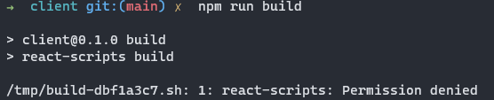
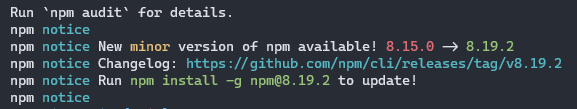
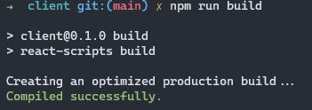

### 문제상황

npm 명령어를 사용해 빌드를 시키려 했는데..permission 오류가 나오면서 빌드가 되지 않았다.

그래서 처음엔 권한을 부여하려고 했는데.. 다른 사람들은 있는 파일의 경로에 폴더가 없었다.

뭔가 설치에서 오류가 났겠구나 싶어서 `npm update`를 실행하니 아니나 다를까 에러가 났다.

설치라도 다시 해보자 싶어 `npm install`을 입력하니 역시 에러가 발생했다.

### 해결 과정

모듈을 설치했던 폴더에서 `package-lock.json`과 `node-modules`를 삭제하고 설치를 재개했지만 여전히 되지 않았다.

`which npm`으로 처음 node를 설치하면서 받은 npm 자체를 지우고`rm -rf [which npm으로 찾은 경로]`, node를 처음부터 다시 설치했다.

그리고 `npm install`을 다시 실행했더니 드디어 설치가 완료됐다!!!!!

설치를 깔끔하게 끝냈더니 빌드도 문제없이 진행됐다.

### 해결방법
재설치가 답이다...🥲🥲🥲

